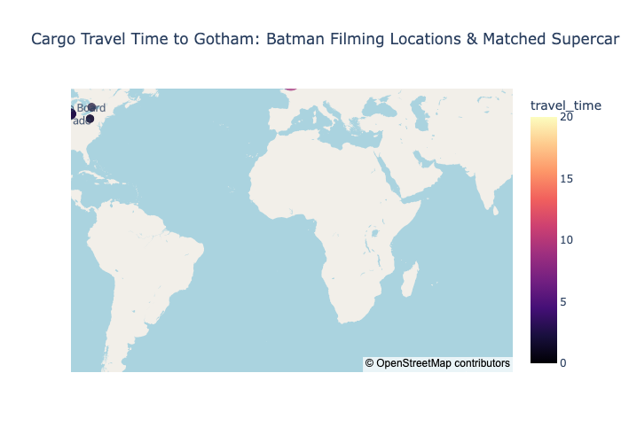

# multi-agent

A two-agent system built with [smolagents](https://github.com/huggingface/smolagents) 1.13. A **manager agent** plans the work, delegates web research to a **web agent**, calculates cargo-plane travel times, and draws the results on a world map. A vision model then checks the final answer before it's accepted.

The task: *find Batman filming locations and supercar factories, calculate how long a cargo plane takes to fly each one to "Gotham" (New York, 40.7128° N, 74.0060° W), and plot them on a map colored by travel time.*

## Architecture

```
                 ┌──────────────────────────────────────┐
  task ────────▶ │ manager_agent   (DeepSeek-R1)        │
                 │ tools: calculate_cargo_travel_time   │
                 │ imports: pandas, plotly, geopandas…  │
                 │ managed_agents: [web_agent]          │
                 └───────┬──────────────────▲───────────┘
                         │ web_agent(task=…) │ written report
                         ▼                  │
                 ┌──────────────────────────────────────┐
                 │ web_agent   (Gemma 4 via Ollama)     │
                 │ tools: Google search (Serper),       │
                 │        visit webpage, cargo time     │
                 └──────────────────────────────────────┘
                         │
  final answer ──▶ check_reasoning_and_plot (GPT-4o reads saved_map.png → PASS / FAIL)
```

| Role | Where | Model | API / key |
|---|---|---|---|
| Manager | `src/split_task.py` | DeepSeek-R1 (`deepseek/deepseek-reasoner`) | DeepSeek API, `DEEPSEEK_API_KEY` |
| Web worker | `src/app.py` | Gemma 4 (`ollama_chat/gemma4:31b-cloud`) | Local Ollama server; the `-cloud` model runs on ollama.com |
| Web search | `src/app.py` | — | Serper, `SERPER_API_KEY` |
| Answer checker | `src/split_task.py` | GPT-4o (vision) | OpenAI API, `OPENAI_API_KEY` |

## How it works

1. **The worker (`web_agent`, `src/app.py`)** is a `CodeAgent` with web tools. Because it has a `name` and a `description`, another agent can call it.
2. **The manager (`manager_agent`, `src/split_task.py`)** lists `web_agent` in `managed_agents`. smolagents describes `web_agent` to the manager as something it can call, so the manager's own Python code can delegate like this:
   ```python
   report = web_agent(task="Find Batman filming locations with lat/lon coordinates")
   ```
   That call starts a full, separate agent run, with its own search → visit page → reason loop of up to 10 steps. Only the worker's written report comes back to the manager.
3. **The manager calculates and plots.** It calls `calculate_cargo_travel_time` for each location, builds a DataFrame, draws a `plotly` `scatter_map`, and saves `saved_map.png`.
4. **The manager re-plans.** With `planning_interval=5`, it writes a fresh plan every 5 steps.
5. **GPT-4o checks the final answer.** `final_answer_checks=[check_reasoning_and_plot]` sends the map and the manager's summarized steps to GPT-4o. On `FAIL`, the check raises an error, the manager sees the feedback, and it tries again, so one run can make several GPT-4o calls.

**Why two agents:** context isolation. Search results and page text stay in the worker's memory, and the manager only sees short reports. The split also lets each job use a suitable model: a reasoning model for planning, a cheaper model for browsing, and a vision model for checking.

### The tool

`calculate_cargo_travel_time` (`src/app.py`) calculates the great-circle distance with the haversine formula. It adds 10% for indirect routing, divides by the cruising speed (750 km/h by default), and adds 1 hour for takeoff and landing. For example, Chicago → Sydney comes out at `22.82` hours.

## Setup

The venv is managed by [uv](https://github.com/astral-sh/uv), so it has no `pip` of its own.

```bash
uv venv --python 3.12
uv pip install --python .venv/bin/python -r requirements.txt
```

`smolagents` is pinned to `1.13.0` because `openinference-instrumentation-smolagents==0.1.9` depends on it (see the comment in `requirements.txt`). Installing a bare `smolagents[litellm]` would upgrade smolagents and break that pin.

Create a `.env` file (it's gitignored) containing:

```
DEEPSEEK_API_KEY=...
SERPER_API_KEY=...
OPENAI_API_KEY=...
```

Start Ollama and make sure `gemma4:31b-cloud` is available (`ollama list`).

## Run

```bash
# Multi-agent run: the manager delegates to web_agent and plots saved_map.png
.venv/bin/python src/split_task.py

# Worker on its own: runs web_agent directly and prints its reports
.venv/bin/python src/app.py
```

Importing `app` doesn't start anything. The standalone runs in `app.py` sit under `if __name__ == "__main__":`, so `split_task.py` can import `web_agent` without starting two extra agent runs.

## Example output

`saved_map.png` from one run:



The framing is poor: the map is centered on the Atlantic, so the points in the US and Europe are cut off at the edges. Tightening the prompt, for example asking for a map centered on the North Atlantic or with `zoom` fitted to the points, should improve it.

## Fixes made while setting this up

- **`ModuleNotFoundError: No module named 'src'`:** `split_task.py` now uses `from app import ...`. Running `python src/split_task.py` puts `src/` on the path, not the project root.
- **Tool passed as a call:** `tools=[calculate_cargo_travel_time()]` became `tools=[calculate_cargo_travel_time]`. The parentheses called the tool with no arguments.
- **`LLM Provider NOT provided`:** `deepseek-ai/DeepSeek-R1` has no LiteLLM provider prefix. The manager now uses `deepseek/deepseek-reasoner` through DeepSeek's API, with no Ollama `api_base`.

## Known issues

- `calculate_cargo_travel_time` is given to both agents, so either one may calculate travel times. Keeping it on the manager only would make the split cleaner.
- The last line of `split_task.py`, `manager_agent.python_executor.state["fig"]`, only displays something in a notebook. In a script it does nothing. Use the return value of `manager_agent.run(...)`, which is the object passed to `final_answer`, and call `.show()` on it.
- The example code in the prompt saves to `saved_image.png`, but the checker expects `saved_map.png`.
